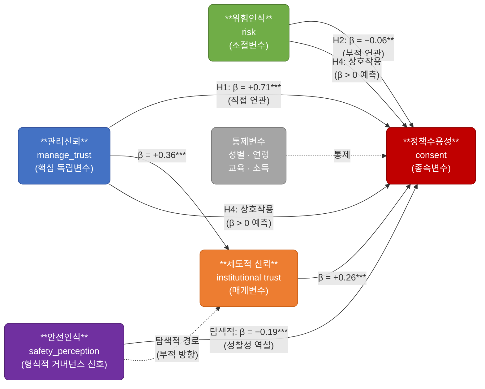

# 연구모형: 하이브리드 거버넌스 맥락에서의 재난 데이터 정책수용성

## 연구모형 다이어그램

---

## 변수 및 가설 요약

| 구분 | 변수 | 측정 | 역할 |
|------|------|------|------|
| 종속변수 | 정책수용성 (consent) | q7, q8, q9 평균 (α=.876) | 재난 개인정보 제공 동의 의향 |
| 독립변수 | 관리신뢰 (manage_trust) | q5, q6 평균 (α=.834) | 기관 데이터 관리 역량 신뢰 |
| 조절변수 | 위험인식 (risk) | q21, q22 평균 (α=.833) | 개인정보 활용 위험 지각 |
| 매개변수 | 제도적 신뢰 (institutional trust) | q26 단일 문항 | 재난 기관 확산적 신뢰 |
| 거버넌스 신호 | 안전인식 (safety_perception) | q25 이분형 | 안전관리 주관적 평가 |
| 통제변수 | 성별, 연령, 교육, 소득 | 인구통계 | 인구통계 특성 |

---

## 가설 요약

| 가설 | 내용 | 방향 | 결과 |
|------|------|------|------|
| **H1** | 관리신뢰 → 정책수용성 (안전인식 대비 상대적 강도 우위) | β > 0 | **지지** (β=.71***) |
| **H2** | 위험인식 → 정책수용성 (부적 연관) | β < 0 | **지지** (β=−.06**) |
| **H3** | 제도적 신뢰의 부분 매개 (관리신뢰 → 제도적 신뢰 → 정책수용성) | 간접효과 유의 | **지지** (95% CI 0포함 안 함) |
| **H4** | 위험인식의 조절효과 (관리신뢰 × 위험인식 상호작용) | β > 0 예측 | **미지지** (유의하지 않음) |

---

## 이론적 배경

- **Beck (1992)**: 위험사회론 — 재귀적 근대화 조건에서 형식적 안전관리보다 관계적 신뢰의 중요성 증대
- **Luhmann (1979)**: 신뢰의 복잡성 축소 기능 — 불확실성 미해소 상태에서의 수용 판단 가능성
- **Wynne (1992)**: 성찰성의 역설 — 안전관리 가시화가 오히려 제도신뢰를 약화시킬 수 있음
- **Giddens (1990)**: 신뢰 대체 메커니즘 — 형식적 전문성의 고정점 역할 약화 시 관계적 신뢰가 대체
