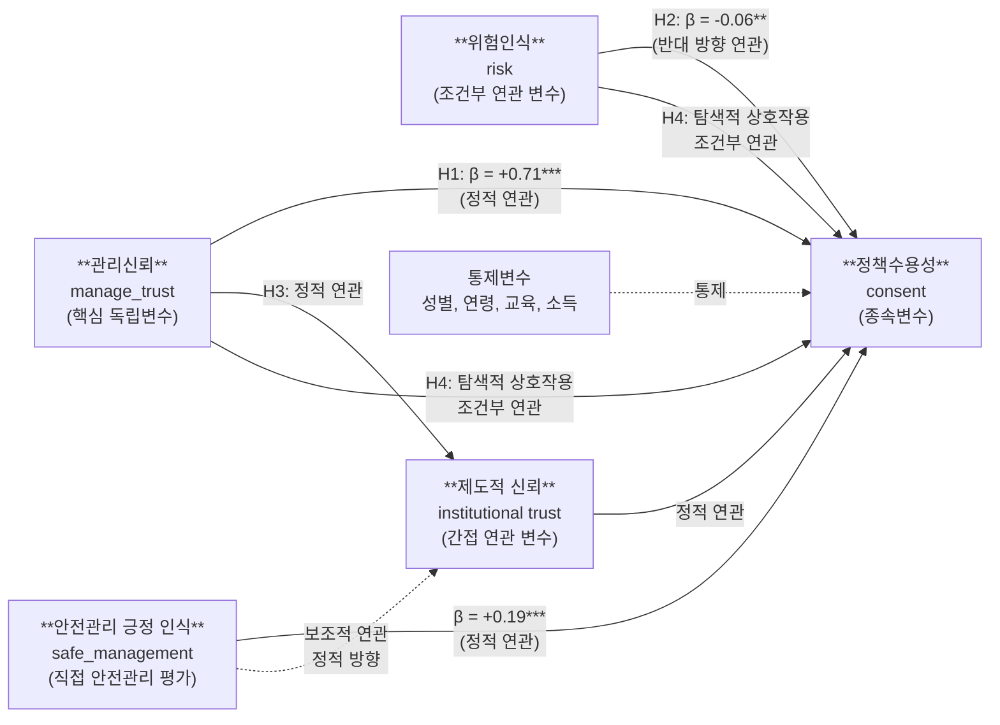

# 연구모형: 하이브리드 거버넌스 맥락에서의 재난 데이터 정책수용성

## 연구모형 다이어그램



## 변수 정의

| 구분 | 변수 | 측정 | 역할 |
|---|---|---|---|
| 종속변수 | 정책수용성 (`consent`) | q7, q8, q9 평균, α=.876 | 재난 개인정보 제공·공유·활용 동의 |
| 핵심 독립변수 | 관리신뢰 (`manage_trust`) | q5, q6 평균, α=.834 | 기관의 데이터 활용 필요성·효과성에 대한 신뢰 |
| 직접 안전관리 평가 | 안전관리 긍정 인식 (`safe_management`) | q25 역코딩 더미: 1=안전하게 관리된다고 인식, 0=그렇지 않음 | 재난 개인정보의 안전한 관리에 대한 긍정 평가 |
| 조건부 연관 변수 | 위험인식 (`risk`) | q21, q22 평균, α=.833 | 개인정보 유출·오남용 위험 인식 |
| 간접 연관 변수 | 제도적 신뢰 (`trust`) | q26 단일 문항 | 재난 대응 정부기관에 대한 확산적 신뢰 |
| 통제변수 | 성별, 연령, 교육, 소득 | 인구통계 변수 | 응답자 특성 통제 |

## q25 코딩 및 재코딩

원자료의 q25는 다음과 같이 코딩되어 있다.

| q25 raw value | 의미 |
|---:|---|
| 1 | 예, 개인정보가 안전하게 관리되고 있다고 생각함 |
| 2 | 아니오, 개인정보가 안전하게 관리되고 있다고 생각하지 않음 |

따라서 원코딩 q25를 그대로 회귀모형에 투입하면 계수의 음의 부호는 “안전하지 않다고 생각하는 방향”을 의미한다. 본 수정본에서는 해석의 일관성을 위해 다음과 같이 긍정 방향 변수를 사용한다.

```python
safe_management = 1 if q25 == 1 else 0
```

즉 `safe_management`가 높을수록 “안전하게 관리된다고 보는 인식”이 높다.

## 가설 및 분석 명제

| 가설 | 내용 | 예상 방향 | 결과 |
|---|---|---|---|
| H1 | 관리신뢰는 정책수용성과 정적으로 연관되며, 비교적 큰 관찰된 비표준화 계수를 보인다. | β > 0 | 지지, β=.713*** |
| H2 | 위험인식은 정책수용성과 반대 방향으로 연관된다. | β < 0 | 지지, β=-.064** |
| H3 | 제도적 신뢰는 관리신뢰와 정책수용성 사이에서 유의한 간접 연관 패턴을 보인다. | 간접 연관 유의 | 탐색적 지지, 95% CI가 0 미포함 |
| H4 | 위험인식이 높은 조건에서 관리신뢰와 정책수용성의 정적 연관 기울기는 더 크게 나타난다. | 상호작용 β > 0 | 탐색적 부합, β=.084** |

## 이론적 배경의 수정 방향

- Beck(1992)의 위험사회론은 재난 데이터 거버넌스에서 불확실성과 위험인식이 정책수용성을 제약하는 맥락을 설명하는 중범위 이론 자원으로 사용한다.
- Luhmann(1979)의 신뢰 이론은 관리신뢰가 불확실성 조건에서 정책수용성을 가능하게 하는 복잡성 축소 자원임을 설명한다.
- 안전관리 긍정 인식과 관리신뢰는 모두 정책수용성과 정적으로 연관되며, 관리신뢰는 비교적 큰 관찰된 비표준화 계수를 보인다. 따라서 본 연구의 중심 기여는 **안전관리 긍정 인식과 관계적 관리신뢰의 비교 연관 구조**에 있다.
- 위험사회론은 위험인식과 제도적 불확실성의 배경 이론으로 제한적으로 활용한다.


